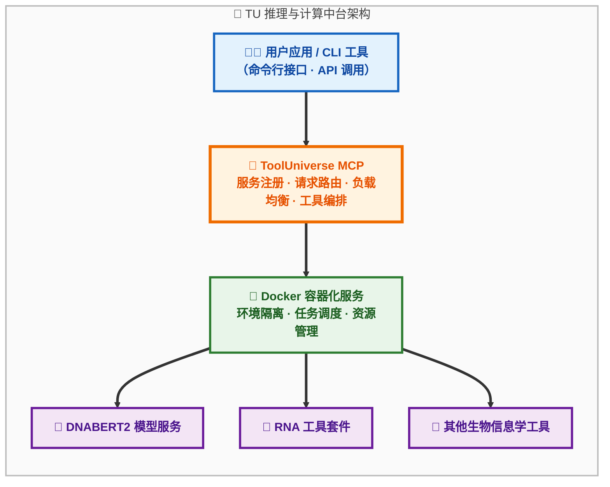

# 🧬 ToolUniverse 生物信息学工具使用指南

<div align="center">
  
  <p><em>强大的生物信息学工具管理中台</em></p>
</div>

## 📑 目录

- [整体架构概述](#整体架构概述)
- [准备工作](#准备工作)
- [部署步骤](#部署步骤)
- [使用生物信息学工具](#使用生物信息学工具)
- [高级用法](#高级用法)
- [故障排除](#故障排除)
- [性能优化](#性能优化)
- [总结](#总结)

## 🔍 整体架构概述

ToolUniverse 是一个强大的工具管理中台，专为管理和调用各种生物信息学工具而设计。其核心架构包含以下几个关键组件：

### 🧩 核心组件

- **Docker 容器化模型服务** 🐳 - 为计算密集型任务（如 DNABERT2）提供隔离的运行环境
- **工具注册与发现系统** 🔍 - 统一管理和发现各种生物信息学工具
- **模型计算协议 (MCP) 服务** 📡 - 作为工具调用的中间层，处理请求转发和结果聚合
- **命令行界面工具** 💻 - 提供简单直观的用户接口，方便调用各种功能

### 📊 架构流程图



## 🔧 准备工作

### 📋 环境要求

- ✅ **Docker 和 Docker Compose** - 用于容器化服务的部署和管理
- ✅ **Python 3.8 或更高版本** - 运行 ToolUniverse 及其工具
- ✅ **足够的磁盘空间** - 用于存储 Docker 镜像和模型
- ✅ **8GB+ 内存** - 推荐配置，确保 Docker 容器稳定运行

## 🚀 部署步骤

### 🐳 启动 Docker 模型服务

首先，确保您的 Docker 环境已正确安装并正在运行。然后，使用以下命令启动生物信息学模型服务：

```bash
# 📁 进入 ToolUniverse 目录
cd /mnt/models/yigex/ToolUniverse

# ⚙️ 复制环境配置文件
cp .env.template .env

# 🚀 启动 Docker 容器服务
docker-compose up -d
```

这将启动包括 DNABERT2 在内的多个生物信息学模型服务。您可以使用以下命令检查服务状态：

```bash
# 📊 检查服务状态
docker-compose ps
```

### 🐍 配置 Python 虚拟环境并安装 ToolUniverse

接下来，设置 Python 虚拟环境并安装 ToolUniverse：

```bash
# 🌱 创建 Python 虚拟环境
python3 -m venv tooluniverse_env

# 🧩 激活虚拟环境
source tooluniverse_env/bin/activate

# 📦 安装 ToolUniverse
pip install -e .

# 📝 安装额外依赖
pip install -r requirements.txt
```

### 📡 启动 ToolUniverse MCP 服务

MCP (Model Computing Protocol) 服务是 ToolUniverse 的核心组件，负责管理和转发工具调用请求：

```bash
# 📁 进入生物信息学工具目录
cd /mnt/models/yigex/ToolUniverse/examples/bio_models

# 🚀 启动专用生物模型 MCP 服务
python bio_mcp_server.py
```

服务默认在本地 8080 端口启动。您可以通过修改配置文件来调整端口和其他参数。

## 🧬 使用生物信息学工具

ToolUniverse 提供了多个命令行工具，用于调用各种生物信息学功能。

### 🧬 使用 DNABERT2 工具

DNABERT2 是一个用于 DNA 序列分析的预训练语言模型，支持嵌入向量生成和序列分类任务。

#### 📝 基本用法

```bash
# 📁 进入生物信息学工具示例目录
cd /mnt/models/yigex/ToolUniverse/examples/bio_models

# 🔬 使用虚拟环境中的 Python 运行工具
../tooluniverse_env/bin/python dnabert2_tool_cli.py --sequence "ATCGATCGATCGATCGATCG" --task embedding
```

#### ⚙️ 可用参数

| 参数 | 描述 |
|------|------|
| `--sequence` | 指定单个 DNA 序列 |
| `--sequences` | 指定多个 DNA 序列（空格分隔） |
| `--sequence-file` | 从文件中读取序列（每行一个） |
| `--task` | 任务类型，可选值为 `embedding` 或 `classification` |
| `--json` | 以 JSON 格式输出结果 |
| `--output` | 输出文件路径 |
| `--use-docker` | 是否使用 Docker 模式（默认为 True） |

#### 🔍 示例：生成嵌入向量

```bash
# 📊 生成嵌入向量并以 JSON 格式输出
../tooluniverse_env/bin/python dnabert2_tool_cli.py --sequence "ATCGATCGATCGATCGATCG" --task embedding --json
```

#### 🔬 示例：分类任务

```bash
# 🧪 执行序列分类任务
../tooluniverse_env/bin/python dnabert2_tool_cli.py --sequence "ATCGATCGATCGATCGATCG" --task classification
```

### 🧪 使用 RNA 工具包

RNA 工具包提供了多个用于 RNA 序列分析的工具，包括 RNA 二级结构预测、序列比较、Motif 扫描和 BLAST 搜索。

#### 📝 基本用法

RNA 工具包使用子命令结构，您可以通过以下命令查看所有可用工具：

```bash
# 📚 查看 RNA 工具包帮助
cd /mnt/models/yigex/ToolUniverse/examples/bio_models
../tooluniverse_env/bin/python rna_tools_cli.py --help
```

#### 🧬 RNA 二级结构预测

```bash
# 🧬 预测 RNA 二级结构
../tooluniverse_env/bin/python rna_tools_cli.py rna_fold --sequence "AUGGCCAUUGCAUUCAGAU" --json
```

#### 🔄 序列比较

```bash
# 🔄 比较两个 RNA 序列
../tooluniverse_env/bin/python rna_tools_cli.py seq_compare --seq1 "AUGGCCAUU" --seq2 "AUGGUCACU"
```

#### 🔍 JASPAR Motif 扫描

```bash
# 🔍 扫描序列中的 JASPAR Motif
../tooluniverse_env/bin/python rna_tools_cli.py jaspar_scan --sequence "ATCGATCGATCGATCGATCG" --species 9606 --threshold 0.85 --top 10
```

#### 🧬 BLAST 搜索

```bash
# 🧬 执行 BLAST 序列搜索
../tooluniverse_env/bin/python rna_tools_cli.py blast_search --sequence "ATCGATCGATCGATCGATCG" --program blastn --database nt --email user@example.com --max-results 10
```

## ⚡ 高级用法

### 📊 批量处理序列

对于大量序列的处理，可以使用 `--sequence-file` 参数或 `--sequences` 参数：

```bash
# 📁 从文件批量处理序列
../tooluniverse_env/bin/python dnabert2_tool_cli.py --sequence-file sequences.txt --task embedding --output results.json

# 📋 直接指定多个序列
../tooluniverse_env/bin/python dnabert2_tool_cli.py --sequences "ATCGATCG" "GCTAGCTA" "CGATCGAT" --task classification
```

### 🛠️ 自定义 Docker 配置

如果您需要自定义 Docker 服务配置，可以修改 `docker-compose.yml` 文件：

```bash
# 📁 进入 ToolUniverse 目录
cd /mnt/models/yigex/ToolUniverse

# 📝 编辑 Docker 配置文件
vi docker-compose.yml

# 🔄 修改后重启服务
docker-compose up -d
```

### 📋 查看日志

查看 ToolUniverse 和 Docker 容器的日志：

```bash
# 📊 查看 MCP 服务日志
tail -f /var/log/tooluniverse/mcp.log

# 🐳 查看 Docker 容器日志
docker-compose logs -f
```

## 🛠️ 故障排除

### ❓ 常见问题

- **Docker 服务启动失败** ❌ - 检查 Docker 是否正确安装，以及是否有足够的权限
- **工具调用超时** ⏱️ - 对于大型序列或复杂任务，可能需要增加超时设置
- **内存不足错误** 🧠 - 考虑增加 Docker 容器的内存限制

### 🔍 调试建议

- 使用 `--json` 参数输出详细的 JSON 格式结果，便于调试
- 检查 MCP 服务日志以获取详细的错误信息
- 确保所有 Docker 容器都处于运行状态

## ⚡ 性能优化

- ⚡ 对于批量处理，优先使用 `--sequence-file` 以减少命令行参数的复杂性
- 🔄 对于频繁调用，可以考虑使用 API 接口而不是命令行工具
- 💾 确保系统有足够的资源分配给 Docker 容器

## 📝 总结

ToolUniverse 提供了一个统一的平台，用于管理和调用各种生物信息学工具。通过 Docker 容器化和 MCP 服务，它实现了工具的隔离部署和统一访问，极大地简化了生物信息学分析的工作流程。

---

**⚠️ 注意**：本指南基于当前 ToolUniverse 的实现，随着项目的发展，某些命令和参数可能会有所变化。请参考最新的项目文档获取最准确的信息。

**📧 联系我们**：如果您在使用过程中遇到任何问题，请提交 Issue 或联系开发团队。

---

<p align="center">
  <strong>🔬 ToolUniverse - 释放生物信息学研究的无限可能 🔬</strong>
</p>