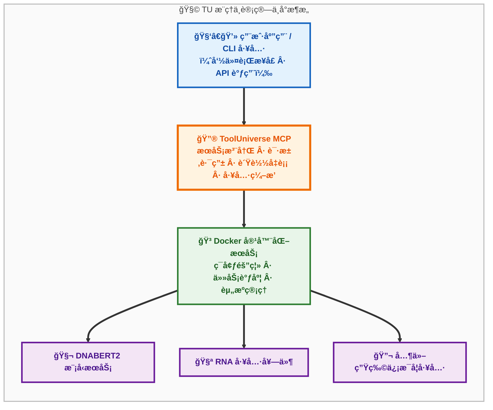

# 🧬 ToolUniverse 生物信æ¯å­¦å·¥å…·ä½¿ç”¨æŒ‡å—

<div align="center">
  
  <p><em>强大的生物信æ¯å­¦å·¥å…·ç®¡ç†ä¸­å°</em></p>
</div>

## 📑 目录

- [整体æ¶æ„概述](#整体æ¶æ„概述)
- [准备工作](#准备工作)
- [部署步骤](#部署步骤)
- [使用生物信æ¯å­¦å·¥å…·](#使用生物信æ¯å­¦å·¥å…·)
- [高级用法](#高级用法)
- [æ•…éšœæ’除](#æ•…éšœæ’除)
- [性能优化](#性能优化)
- [总结](#总结)

## 🔠整体æ¶æ„概述

ToolUniverse 是一个强大的工具管ç†ä¸­å°ï¼Œä¸“为管ç†å’Œè°ƒç”¨å„ç§ç”Ÿç‰©ä¿¡æ¯å­¦å·¥å…·è€Œè®¾è®¡ã€‚其核心æ¶æ„包å«ä»¥ä¸‹å‡ ä¸ªå…³é”®ç»„件：

### 🧩 核心组件

- **Docker 容器化模å‹æœåŠ¡** 🳠- 为计算密集å‹ä»»åŠ¡ï¼ˆå¦‚ DNABERT2）æ供隔离的è¿è¡Œç¯å¢ƒ
- **工具注册ä¸å‘ç°ç³»ç»Ÿ** 🔠- 统一管ç†å’Œå‘ç°å„ç§ç”Ÿç‰©ä¿¡æ¯å­¦å·¥å…·
- **模å‹è®¡ç®—åè®® (MCP) æœåŠ¡** 📡 - 作为工具调用的中间层，处ç†è¯·æ±‚转å‘和结æœèšåˆ
- **命令行界é¢å·¥å…·** 💻 - æ供简å•ç›´è§‚的用户æ¥å£ï¼Œæ–¹ä¾¿è°ƒç”¨å„ç§åŠŸèƒ½

### 📊 æ¶æ„æµç¨‹å›¾


```mermaid

flowchart TB
%% ======= æ ·å¼å®šä¹‰ =======
classDef bg fill:#FAFAFA,stroke:#BDBDBD,stroke-width:2px,color:#424242
classDef user fill:#E3F2FD,stroke:#1565C0,stroke-width:3px,color:#0D47A1,font-weight:bold
classDef mcp fill:#FFF3E0,stroke:#EF6C00,stroke-width:4px,color:#E65100,font-weight:bold
classDef runtime fill:#E8F5E9,stroke:#2E7D32,stroke-width:3px,color:#1B5E20,font-weight:bold
classDef model fill:#F3E5F5,stroke:#6A1B9A,stroke-width:3px,color:#4A148C,font-weight:bold

%% ======= 外层背景分组（整体背景æ¿ï¼‰ =======
subgraph ALL["🧩 TU æ¨ç†ä¸è®¡ç®—中å°æ¶æ„"]

direction TB

    %% ======= 内部节点 =======
    A[🧑â€ğŸ’» 用户应用 / CLI 工具<br>（命令行æ¥å£ · API 调用）]
    B[🔮 ToolUniverse MCP<br>æœåŠ¡æ³¨å†Œ · 请求路由 · è´Ÿè½½å‡è¡¡ · 工具编æ’]
    C[🳠Docker 容器化æœåŠ¡<br>ç¯å¢ƒéš”离 · 任务调度 · 资æºç®¡ç†]
    D1[🧬 DNABERT2 模å‹æœåŠ¡]
    D2[🧪 RNA 工具套件]
    D3[🔬 其他生物信æ¯å­¦å·¥å…·]

    %% è¿æ¥ç»“æ„
    A ==> B
    B ==> C
    C ==> D1
    C ==> D2
    C ==> D3

    %% æ ·å¼å…³è”
    class A user
    class B mcp
    class C runtime
    class D1,D2,D3 model

end

%% 外层背景样å¼
class ALL bg


```

## 🔧 准备工作

### 📋 ç¯å¢ƒè¦æ±‚

- ✅ **Docker å’Œ Docker Compose** - 用äºå®¹å™¨åŒ–æœåŠ¡çš„部署和管ç†
- ✅ **Python 3.8 或更高版本** - è¿è¡Œ ToolUniverse åŠå…¶å·¥å…·
- ✅ **足够的ç£ç›˜ç©ºé—´** - 用äºå­˜å‚¨ Docker é•œåƒå’Œæ¨¡å‹
- ✅ **8GB+ 内存** - æ¨èé…ç½®ï¼Œç¡®ä¿ Docker 容器稳定è¿è¡Œ

## 🚀 部署步骤

### 🳠å¯åŠ¨ Docker 模å‹æœåŠ¡

首先，确ä¿æ‚¨çš„ Docker ç¯å¢ƒå·²æ­£ç¡®å®‰è£…并正在è¿è¡Œã€‚然å，使用以下命令å¯åŠ¨ç”Ÿç‰©ä¿¡æ¯å­¦æ¨¡å‹æœåŠ¡ï¼š

```bash
# 📠进入 ToolUniverse 目录
cd /mnt/models/yigex/ToolUniverse

# âš™ï¸ å¤åˆ¶ç¯å¢ƒé…置文件
cp .env.template .env

# 🚀 å¯åŠ¨ Docker 容器æœåŠ¡
docker-compose up -d
```

这将å¯åŠ¨åŒ…括 DNABERT2 在内的多个生物信æ¯å­¦æ¨¡å‹æœåŠ¡ã€‚您å¯ä»¥ä½¿ç”¨ä»¥ä¸‹å‘½ä»¤æ£€æŸ¥æœåŠ¡çŠ¶æ€ï¼š

```bash
# 📊 检查æœåŠ¡çŠ¶æ€
docker-compose ps
```

### ğŸ é…ç½® Python 虚拟ç¯å¢ƒå¹¶å®‰è£… ToolUniverse

æ¥ä¸‹æ¥ï¼Œè®¾ç½® Python 虚拟ç¯å¢ƒå¹¶å®‰è£… ToolUniverse：

```bash
# 🌱 创建 Python 虚拟ç¯å¢ƒ
python3 -m venv tooluniverse_env

# 🧩 激活虚拟ç¯å¢ƒ
source tooluniverse_env/bin/activate

# 📦 安装 ToolUniverse
pip install -e .

# 📠安装é¢å¤–ä¾èµ–
pip install -r requirements.txt
```

### 📡 å¯åŠ¨ ToolUniverse MCP æœåŠ¡

MCP (Model Computing Protocol) æœåŠ¡æ˜¯ ToolUniverse 的核心组件，负责管ç†å’Œè½¬å‘工具调用请求：

```bash
# 📠进入生物信æ¯å­¦å·¥å…·ç›®å½•
cd /mnt/models/yigex/ToolUniverse/examples/bio_models

# 🚀 å¯åŠ¨ä¸“ç”¨ç”Ÿç‰©æ¨¡å‹ MCP æœåŠ¡
python bio_mcp_server.py
```

æœåŠ¡é»˜è®¤åœ¨æœ¬åœ° 8080 端å£å¯åŠ¨ã€‚您å¯ä»¥é€šè¿‡ä¿®æ”¹é…置文件æ¥è°ƒæ•´ç«¯å£å’Œå…¶ä»–å‚数。

## 🧬 使用生物信æ¯å­¦å·¥å…·

ToolUniverse æ供了多个命令行工具，用äºè°ƒç”¨å„ç§ç”Ÿç‰©ä¿¡æ¯å­¦åŠŸèƒ½ã€‚

### 🧬 使用 DNABERT2 工具

DNABERT2 æ˜¯ä¸€ä¸ªç”¨äº DNA åºåˆ—分æ的预训练语言模å‹ï¼Œæ”¯æŒåµŒå…¥å‘é‡ç”Ÿæˆå’Œåºåˆ—分类任务。

#### 📠基本用法（直æ¥å®ä¾‹è°ƒç”¨ï¼‰

```bash
# 📠进入生物信æ¯å­¦å·¥å…·ç¤ºä¾‹ç›®å½•
cd /mnt/models/yigex/ToolUniverse/examples/bio_models

# 🔬 使用虚拟ç¯å¢ƒä¸­çš„ Python è¿è¡Œå·¥å…·
../../tooluniverse_env/bin/python dnabert2_tool_cli.py --sequence "ATCGATCGATCGATCGATCG" --task embedding
```

#### 📡 基本用法（通过MCP调用）

```bash
# 📠进入生物信æ¯å­¦å·¥å…·ç¤ºä¾‹ç›®å½•
cd /mnt/models/yigex/ToolUniverse/examples/bio_models

# 🔮 通过MCPæœåŠ¡è°ƒç”¨å·¥å…·
../../tooluniverse_env/bin/python dnabert2_tool_cli.py --sequence "ATCGATCGATCGATCGATCG" --task embedding --use-mcp --mcp-url http://localhost:8080

# 📡 使用默认MCP端å£è°ƒç”¨å·¥å…·
../../tooluniverse_env/bin/python dnabert2_tool_cli.py --sequence "ATCGATCGATCGATCGATCG" --task embedding --use-mcp
```

#### âš™ï¸ å¯ç”¨å‚æ•°

| å‚æ•° | æè¿° |
|------|------|
| `--sequence` | 指定å•ä¸ª DNA åºåˆ— |
| `--sequences` | 指定多个 DNA åºåˆ—（空格分隔） |
| `--sequence-file` | ä»æ–‡ä»¶ä¸­è¯»å–åºåˆ—（æ¯è¡Œä¸€ä¸ªï¼‰ |
| `--task` | 任务类å‹ï¼Œå¯é€‰å€¼ä¸º `embedding` 或 `classification` |
| `--json` | 以 JSON æ ¼å¼è¾“å‡ºç»“æœ |
| `--output` | 输出文件路径 |
| `--use-docker` | 是å¦ä½¿ç”¨ Docker 模å¼ï¼ˆé»˜è®¤ä¸º True） |
| `--use-mcp` | 是å¦é€šè¿‡ MCP æœåŠ¡è°ƒç”¨å·¥å…·ï¼ˆé»˜è®¤ä¸º False） |
| `--mcp-url` | MCP æœåŠ¡ URL，默认为 http://localhost:8000 |

#### 🔠示例：生æˆåµŒå…¥å‘é‡

```bash
# 📊 生æˆåµŒå…¥å‘é‡å¹¶ä»¥ JSON æ ¼å¼è¾“出（直æ¥è°ƒç”¨ï¼‰
../../tooluniverse_env/bin/python dnabert2_tool_cli.py --sequence "ATCGATCGATCGATCGATCG" --task embedding --json

# 📡 通过MCP生æˆåµŒå…¥å‘é‡
../../tooluniverse_env/bin/python dnabert2_tool_cli.py --sequence "ATCGATCGATCGATCGATCG" --task embedding --use-mcp --mcp-url http://localhost:8080

# 📡 使用默认MCP端å£ç”ŸæˆåµŒå…¥å‘é‡
../../tooluniverse_env/bin/python dnabert2_tool_cli.py --sequence "ATCGATCGATCGATCGATCG" --task embedding --use-mcp
```

#### 🔬 示例：分类任务

```bash
# 🧪 执行åºåˆ—分类任务（直æ¥è°ƒç”¨ï¼‰
../../tooluniverse_env/bin/python dnabert2_tool_cli.py --sequence "ATCGATCGATCGATCGATCG" --task classification

# 📡 通过MCP执行åºåˆ—分类任务
../../tooluniverse_env/bin/python dnabert2_tool_cli.py --sequence "ATCGATCGATCGATCGATCG" --task classification --use-mcp --mcp-url http://localhost:8080

# 📡 使用默认MCP端å£æ‰§è¡Œåºåˆ—分类任务
../../tooluniverse_env/bin/python dnabert2_tool_cli.py --sequence "ATCGATCGATCGATCGATCG" --task classification --use-mcp
```

### 🧪 使用 RNA 工具包

RNA 工具包æä¾›äº†å¤šä¸ªç”¨äº RNA åºåˆ—分æ的工具，包括 RNA 二级结æ„预测ã€åºåˆ—比较ã€Motif 扫æå’Œ BLAST æœç´¢ã€‚

#### 📠基本用法

RNA 工具包使用å­å‘½ä»¤ç»“æ„，您å¯ä»¥é€šè¿‡ä»¥ä¸‹å‘½ä»¤æŸ¥çœ‹æ‰€æœ‰å¯ç”¨å·¥å…·ï¼š

```bash
# 📚 查看 RNA 工具包帮助
cd /mnt/models/yigex/ToolUniverse/examples/bio_models
../../tooluniverse_env/bin/python rna_tools_cli.py --help
```

所有 RNA 工具都支æŒé€šè¿‡ MCP 调用，åªéœ€æ·»åŠ  `--use-mcp` å’Œå¯é€‰çš„ `--mcp-url` å‚数。

#### âš™ï¸ MCP 调用å‚æ•°

| å‚æ•° | æè¿° | 默认值 |
|------|------|--------|
| `--use-mcp` | 是å¦é€šè¿‡ MCP æœåŠ¡è°ƒç”¨å·¥å…· | False |
| `--mcp-url` | MCP æœåŠ¡ URL | http://localhost:8080 |

#### 🧬 RNA 二级结æ„预测

```bash
# 🧬 预测 RNA 二级结æ„（直æ¥è°ƒç”¨ï¼‰
../../tooluniverse_env/bin/python rna_tools_cli.py rna_fold --sequence "AUGGCCAUUGCAUUCAGAU" --json

# 📡 通过MCP预测 RNA 二级结æ„
../../tooluniverse_env/bin/python rna_tools_cli.py rna_fold --sequence "AUGGCCAUUGCAUUCAGAU" --json --use-mcp --mcp-url http://localhost:8080

# 📡 使用默认MCP端å£é¢„测RNA二级结æ„
../../tooluniverse_env/bin/python rna_tools_cli.py rna_fold --sequence "AUGGCCAUUGCAUUCAGAU" --json --use-mcp
```

#### 🔄 åºåˆ—比较

```bash
# 🔄 比较两个 RNA åºåˆ—（直æ¥è°ƒç”¨ï¼‰
../../tooluniverse_env/bin/python rna_tools_cli.py seq_compare --seq1 "AUGGCCAUU" --seq2 "AUGGUCACU"

# 📡 通过MCP比较两个 RNA åºåˆ—
../../tooluniverse_env/bin/python rna_tools_cli.py seq_compare --seq1 "AUGGCCAUU" --seq2 "AUGGUCACU" --use-mcp --mcp-url http://localhost:8080

# 📡 使用默认MCP端å£æ¯”较åºåˆ—
../../tooluniverse_env/bin/python rna_tools_cli.py seq_compare --seq1 "AUGGCCAUU" --seq2 "AUGGUCACU" --use-mcp
```

#### 🔠JASPAR Motif 扫æ

```bash
# 🔠扫æåºåˆ—中的 JASPAR Motif（直æ¥è°ƒç”¨ï¼‰
../../tooluniverse_env/bin/python rna_tools_cli.py jaspar_scan --sequence "ATCGATCGATCGATCGATCG" --species 9606 --threshold 0.85 --top 10

# 📡 通过MCP扫æåºåˆ—中的 JASPAR Motif
../../tooluniverse_env/bin/python rna_tools_cli.py jaspar_scan --sequence "ATCGATCGATCGATCGATCG" --species 9606 --threshold 0.85 --top 10 --use-mcp --mcp-url http://localhost:8080

# 📡 使用默认MCP端å£æ‰«æMotif
../../tooluniverse_env/bin/python rna_tools_cli.py jaspar_scan --sequence "ATCGATCGATCGATCGATCG" --species 9606 --threshold 0.85 --top 10 --use-mcp
```

#### 🧬 BLAST æœç´¢

```bash
# 🧬 执行 BLAST åºåˆ—æœç´¢ï¼ˆç›´æ¥è°ƒç”¨ï¼‰
../../tooluniverse_env/bin/python rna_tools_cli.py blast_search --sequence "ATCGATCGATCGATCGATCG" --program blastn --database nt --email user@example.com --max-results 10

# 📡 通过MCP执行 BLAST åºåˆ—æœç´¢
../../tooluniverse_env/bin/python rna_tools_cli.py blast_search --sequence "ATCGATCGATCGATCGATCG" --program blastn --database nt --email user@example.com --max-results 10 --use-mcp --mcp-url http://localhost:8080

# 📡 使用默认MCP端å£æ‰§è¡ŒBLASTæœç´¢
../../tooluniverse_env/bin/python rna_tools_cli.py blast_search --sequence "ATCGATCGATCGATCGATCG" --program blastn --database nt --email user@example.com --max-results 10 --use-mcp
```

#### 🔧 MCP 调用模å¼è¯´æ˜

RNA 工具包支æŒä¸¤ç§è°ƒç”¨æ¨¡å¼ï¼š

1. **ç›´æ¥è°ƒç”¨æ¨¡å¼**（默认）：
   - ç›´æ¥å®ä¾‹åŒ–工具类并调用相应方法
   - 适åˆæœ¬åœ°å¼€å‘和测试
   - ä¸éœ€è¦å¯åŠ¨ MCP æœåŠ¡

2. **MCP 调用模å¼**（使用 `--use-mcp` å‚数）：
   - 通过 MCP æœåŠ¡é—´æ¥è°ƒç”¨å·¥å…·
   - 适åˆç”Ÿäº§ç¯å¢ƒå’Œåˆ†å¸ƒå¼éƒ¨ç½²
   - 需è¦å…ˆå¯åŠ¨ MCP æœåŠ¡
   - 支æŒè´Ÿè½½å‡è¡¡å’Œèµ„æºç®¡ç†

MCP 调用模å¼çš„优势：
- 🔄 **è´Ÿè½½å‡è¡¡**：MCP æœåŠ¡å¯ä»¥æ™ºèƒ½åˆ†é…请求到ä¸åŒçš„计算节点
- ğŸ›¡ï¸ **错误处ç†**：æ供统一的错误处ç†å’Œé‡è¯•æœºåˆ¶
- 📊 **监æ§æ—¥å¿—**：集中记录所有工具调用，便äºç›‘æ§å’Œè°ƒè¯•
- 🔧 **é…置管ç†**：统一管ç†å·¥å…·é…置，无需在æ¯ä¸ªå®¢æˆ·ç«¯é‡å¤é…ç½®

## ⚡ 高级用法

### 📊 批é‡å¤„ç†åºåˆ—

对äºå¤§é‡åºåˆ—的处ç†ï¼Œå¯ä»¥ä½¿ç”¨ `--sequence-file` å‚数或 `--sequences` å‚数：

```bash
# 📠ä»æ–‡ä»¶æ‰¹é‡å¤„ç†åºåˆ—（直æ¥è°ƒç”¨ï¼‰
../../tooluniverse_env/bin/python dnabert2_tool_cli.py --sequence-file sequences.txt --task embedding --output results.json

# 📡 通过MCPä»æ–‡ä»¶æ‰¹é‡å¤„ç†åºåˆ—
../../tooluniverse_env/bin/python dnabert2_tool_cli.py --sequence-file sequences.txt --task embedding --output results.json --use-mcp --mcp-url http://localhost:8080

# 📡 使用默认MCP端å£ä»æ–‡ä»¶æ‰¹é‡å¤„ç†åºåˆ—
../../tooluniverse_env/bin/python dnabert2_tool_cli.py --sequence-file sequences.txt --task embedding --output results.json --use-mcp

# 📋 ç›´æ¥æŒ‡å®šå¤šä¸ªåºåˆ—（直æ¥è°ƒç”¨ï¼‰
../../tooluniverse_env/bin/python dnabert2_tool_cli.py --sequences "ATCGATCG" "GCTAGCTA" "CGATCGAT" --task classification

# 📡 通过MCPç›´æ¥æŒ‡å®šå¤šä¸ªåºåˆ—
../../tooluniverse_env/bin/python dnabert2_tool_cli.py --sequences "ATCGATCG" "GCTAGCTA" "CGATCGAT" --task classification --use-mcp --mcp-url http://localhost:8080

# 📡 使用默认MCP端å£ç›´æ¥æŒ‡å®šå¤šä¸ªåºåˆ—
../../tooluniverse_env/bin/python dnabert2_tool_cli.py --sequences "ATCGATCG" "GCTAGCTA" "CGATCGAT" --task classification --use-mcp
```

### ğŸ› ï¸ è‡ªå®šä¹‰ Docker é…ç½®

如æœæ‚¨éœ€è¦è‡ªå®šä¹‰ Docker æœåŠ¡é…置，å¯ä»¥ä¿®æ”¹ `docker-compose.yml` 文件：

```bash
# 📠进入 ToolUniverse 目录
cd /mnt/models/yigex/ToolUniverse

# 📠编辑 Docker é…置文件
vi docker-compose.yml

# 🔄 修改åé‡å¯æœåŠ¡
docker-compose up -d
```

### 📋 查看日志

查看 ToolUniverse 和 Docker 容器的日志：

```bash
# 📊 查看 MCP æœåŠ¡æ—¥å¿—
tail -f /var/log/tooluniverse/mcp.log

# 🳠查看 Docker 容器日志
docker-compose logs -f
```

## ğŸ› ï¸ æ•…éšœæ’除

### ⓠ常è§é—®é¢˜

- **Docker æœåŠ¡å¯åŠ¨å¤±è´¥** ⌠- 检查 Docker 是å¦æ­£ç¡®å®‰è£…，以åŠæ˜¯å¦æœ‰è¶³å¤Ÿçš„æƒé™
- **工具调用超时** â±ï¸ - 对äºå¤§å‹åºåˆ—或å¤æ‚任务，å¯èƒ½éœ€è¦å¢åŠ è¶…时设置
- **内存ä¸è¶³é”™è¯¯** 🧠 - 考虑å¢åŠ  Docker 容器的内存é™åˆ¶

### 🔠调试建议

- 使用 `--json` å‚数输出详细的 JSON æ ¼å¼ç»“æœï¼Œä¾¿äºè°ƒè¯•
- 检查 MCP æœåŠ¡æ—¥å¿—以è·å–详细的错误信æ¯
- ç¡®ä¿æ‰€æœ‰ Docker 容器都处äºè¿è¡ŒçŠ¶æ€

## ⚡ 性能优化

- âš¡ 对äºæ‰¹é‡å¤„ç†ï¼Œä¼˜å…ˆä½¿ç”¨ `--sequence-file` 以å‡å°‘命令行å‚æ•°çš„å¤æ‚性
- 🔄 对äºé¢‘ç¹è°ƒç”¨ï¼Œå¯ä»¥è€ƒè™‘使用 API æ¥å£è€Œä¸æ˜¯å‘½ä»¤è¡Œå·¥å…·
- 💾 ç¡®ä¿ç³»ç»Ÿæœ‰è¶³å¤Ÿçš„资æºåˆ†é…ç»™ Docker 容器

## 📠总结

ToolUniverse æ供了一个统一的平å°ï¼Œç”¨äºç®¡ç†å’Œè°ƒç”¨å„ç§ç”Ÿç‰©ä¿¡æ¯å­¦å·¥å…·ã€‚通过 Docker 容器化和 MCP æœåŠ¡ï¼Œå®ƒå®ç°äº†å·¥å…·çš„隔离部署和统一访问，æ大地简化了生物信æ¯å­¦åˆ†æ的工作æµç¨‹ã€‚

---

**âš ï¸ æ³¨æ„**：本指å—基äºå½“å‰ ToolUniverse çš„å®ç°ï¼Œéšç€é¡¹ç›®çš„å‘展，æŸäº›å‘½ä»¤å’Œå‚æ•°å¯èƒ½ä¼šæœ‰æ‰€å˜åŒ–。请å‚考最新的项目文档è·å–最准确的信æ¯ã€‚

**📧 è”系我们**：如æœæ‚¨åœ¨ä½¿ç”¨è¿‡ç¨‹ä¸­é‡åˆ°ä»»ä½•é—®é¢˜ï¼Œè¯·æ交 Issue 或è”系开å‘团队。

---

<p align="center">
  <strong>🔬 ToolUniverse - 释放生物信æ¯å­¦ç ”究的无é™å¯èƒ½ 🔬</strong>
</p>